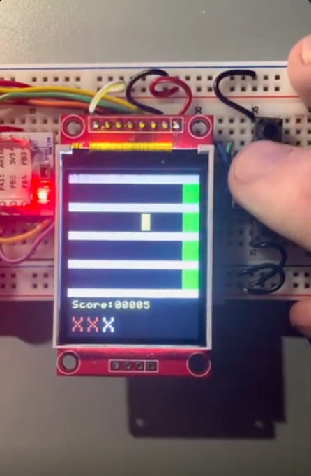

# STM32 Tile Game

Two-player, turn-based reaction game in C for an STM32F031 microcontroller.

## How it plays
Coloured tiles move across one of four lanes. Press the matching button when
the tile reaches the green finish line to score. Three fails and you're out.
Highest score wins, with tie detection and a replay option.

## Hardware
STM32F031 board, colour LCD, four push buttons, buzzer.

## Features
- Randomised lanes, hit detection and scoring
- Three-strike fail system with a grace window
- Sound effects for hits, misses and game music
- 1 ms SysTick timer for timing, polled GPIO for button input

## Build and upload
Built with PlatformIO in VS Code: `pio run` to build, `pio run -t upload` to flash.

## Notes
Built on the module's display and sound libraries. Game logic is my own work.
Written for the Microprocessors module, TU Dublin.
